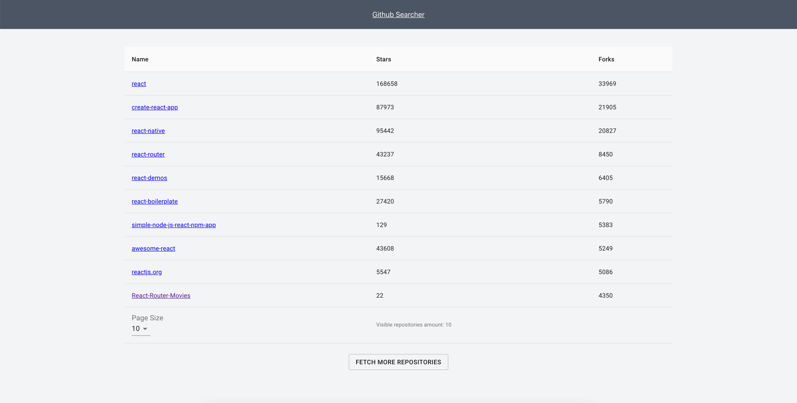

<h1 align="center">Github Repo Searcher</h1>

### ✨ [Demo](https://pgalias.github.io/Github-Repo-Searcher)

## About the project

This is minimalistic user interface for searching for React repositories. It's using
a [GitHub GraphQL API v4](https://developer.github.com/v4/).

### Built with

- React
- Typescript
- Emotion

## Getting started

### Prerequisites

To run this project [GitHub Personal Access Token](https://docs.github.com/en/github/authenticating-to-github/keeping-your-account-and-data-secure/creating-a-personal-access-token) is required.

### Running the app

1. Create env file by  `cp .env.dist .env`
2. Open `.env` file and copy there your personal token under the `REACT_APP_GITHUB_ACCESS_TOKEN` key
3. Install all dependencies by `yarn install`
4. Open app by `yarn start`

## Available commands

- `yarn start` - runs app in dev mode
- `yarn build` - builds app in prod mode
- `yarn test` - runs tests in watch mode
- `yarn coverage` - runs tests in single run with collecting code coverage 
- `yarn deploy` - builds application and pushes it into gh-pages branch
- `yarn eslint` - runs eslint on whole project
- `yarn prettier` - runs prettier on whole project

## Further changes

- Add possibility for user to search a not only React-like repositories

## Author

👤 **Pawel Galias** - [linkedin](https://linkedin.com/in/pawgalias) - [pawel@galias.me](pawel@galias.me)

## Show your support

Give a ⭐️ if this project helped you!
